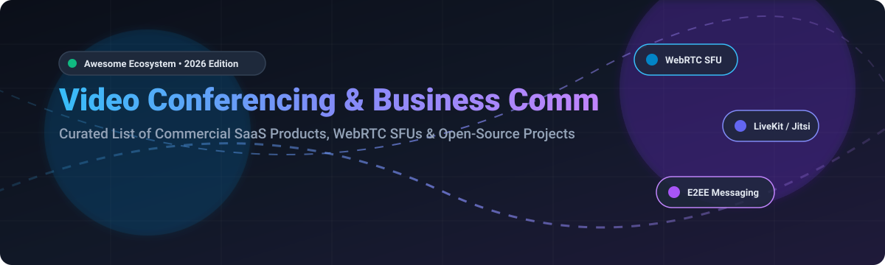

# 📹 Awesome Video Conferencing &amp; Business Communication

  
  
  
  
  

## 🌐 Comprehensive Ecosystem of Video Meetings, Team Messaging &amp; Real-Time Communication

**Curated list of commercial SaaS products, open-source platforms, WebRTC SFU engines, and self-hosted business communication solutions.**

*Updated continuously for developers, solution architects, remote teams, and enterprise CTOs.*

---

### 🔍 Search &amp; SEO Keywords
`WebRTC` • `Video Conferencing` • `Open-Source Zoom Alternative` • `SFU Gateway` • `Business Communication` • `Unified Communications` • `Self-Hosted Voice/Video` • `LiveKit` • `Jitsi Meet` • `Matrix Protocol` • `E2EE Messaging` • `CPaaS`

---

## 📌 Table of Contents
- 🏢 [SaaS / Commercial Hosted Platforms](#-saas--hosted-platforms)
- 🔓 [Open-Source GitHub Projects](#-open-source-github-projects)
- 🛠️ [WebRTC Infrastructure &amp; Frameworks](#%EF%B8%8F-webrtc-infrastructure--frameworks)
- 🤝 [How to Contribute](#-how-to-contribute)
- ⚠️ [Disclaimer &amp; Architecture Notes](#%EF%B8%8F-disclaimer--architecture-notes)
- 💖 [Support &amp; Sponsorship](#-support--sponsorship)
- 📈 [Star History](#-star-history)

---

## 🏢 SaaS / Hosted Platforms

Market Overview: The global video conferencing and unified business communication market is estimated at **$13 billion to $40 billion** (projected to reach $50B+ by 2030) and is **moderately fragmented**, dominated by bundled enterprise tech giants alongside dedicated video conferencing platforms.

| Platform | Company Scale (Revenue / Valuation) | Starting Paid Price | Free Tier / Trial Limit |
|---|---|---|---|
| **[Google Meet](https://meet.google.com/)** Browser-based video conferencing integrated with Google Workspace. | **$4.24T** Market Cap ($350B+ annual revenue / Alphabet Inc.) | **$7.00** / user / month (Google Workspace Business Starter) | Free forever: **60-minute limit** on group calls (up to 100 participants; 24h limit on 1:1 calls). |
| **[Microsoft Teams](https://www.microsoft.com/microsoft-teams/)** Enterprise collaboration hub with video meetings, chat, and Office 365. | **$3.10T** Market Cap ($245B+ annual revenue / Microsoft Corp.) | **$4.00** / user / month (Teams Essentials, annual billing) | Free forever: **60-minute limit** on group calls (up to 100 participants, 5 GB cloud storage). |
| **[Amazon Chime](https://aws.amazon.com/chime/)** AWS pay-as-you-go video conferencing and business communication service. | **$2.71T** Market Cap ($717B+ annual revenue / Amazon.com, Inc.) | **$3.00** / user / day (Pro tier, capped at **$15.00** / user / month max) | Free Basic plan forever: **Unlimited 1:1 voice/video calls** and chat; 3+ participant group meetings require Pro. |
| **[Cisco Webex](https://www.webex.com/)** Enterprise UC suite with meetings, calling, messaging, and compliance certifications. | **$442B** Market Cap ($63.3B annual revenue / Cisco Systems) | **$13.50** / user / month (Webex Starter, annual billing) | Free forever: **40-minute limit** per group meeting (up to 100 participants). |
| **[BlueJeans](https://www.bluejeans.com/)** Enterprise video platform acquired by Verizon for ~$500M; retired in 2024. | **$170B** Parent Market Cap ($138B annual revenue / Verizon Communications; acquired for ~$500M) | **$9.99** / user / month (Standard plan prior to 2024 shutdown) | Service retired (March 2024); historically offered a **14-day free trial** with no permanent free tier. |
| **[Zoom Workplace](https://zoom.us/)** Market-leading video conferencing suite with AI Companion, phone, and chat. | **$27.2B** Market Cap ($4.87B annual revenue / Zoom Video Communications) | **$13.33** / user / month ($159.90/year annual billing for Pro) | Free Basic plan forever: **40-minute limit** on group meetings (up to 100 participants). |
| **[RingCentral Video](https://www.ringcentral.com/)** Unified cloud communications replacing traditional PBX with video &amp; voice. | **$6.50B** Market Cap ($2.50B annual revenue / RingCentral, Inc.) | **$20.00** / user / month (RingEX Core, annual billing) | **14-day free trial** with full features; standalone Video Pro free tier capped calls at 50 minutes. |
| **[GoTo Meeting](https://www.goto.com/meeting)** Veteran video conferencing &amp; screen-sharing platform for simple meeting needs. | **$4.30B** Private Valuation ($1.30B annual revenue / GoTo Technologies) | **$12.00** / organizer / month (Professional plan, annual billing) | **14-day free trial**; limited free version restricted to **3 participants &amp; 40-minute limit**. |
| **[Dialpad Meetings](https://www.dialpad.com/)** AI-powered video meetings with real-time transcription and sentiment analysis. | **$2.20B** Private Valuation ($300M+ ARR / Dialpad, Inc.) | **$15.00** / user / month (Dialpad Standard, annual billing) | **14-day free trial** with full AI features; non-profits eligible for up to 10 free licenses via Dialpad for Good. |
| **[Whereby](https://whereby.com/)** Browser-based, embeddable video meetings without downloads or logins required. | **$48M** Valuation ($10M annual revenue / Whereby AS) | **$10.99** / month (Pro plan for individuals/small teams) | Free forever: **30-minute limit** per meeting, capped at **4 participants** and 1 room URL. |

---

## 🔓 Open-Source GitHub Projects

*Sorted by GitHub Stars_Count (Descending)*

- 🥇 **[Jitsi Meet](https://github.com/jitsi/jitsi-meet)**   
  **The leading open-source video conferencing platform**, Apache-2.0 licensed. WebRTC-based with no account required — start a meeting instantly. Scalable to hundreds of participants per room with Jitsi Videobridge SFU. Features screen sharing, recording, live streaming, chat, hand raising, virtual backgrounds, and Etherpad integration. Self-hostable via Docker or Debian packages without time limits or arbitrary participant caps. The de facto open-source Zoom alternative used worldwide by enterprises, universities, and privacy advocates.

- 🥈 **[LiveKit](https://github.com/livekit/livekit)**   
  **Open-source WebRTC platform for real-time video, audio, and data**, Apache-2.0 licensed. Highly scalable Go-based Selective Forwarding Unit (SFU) architecture with distributed mesh clustering. Provides rich client SDKs for React, Flutter, Swift, Android, Unity, and Node.js. Powers modern web conferencing tools (including La Suite Meet) and commercial video applications.

- 🥉 **[Pion WebRTC](https://github.com/pion/webrtc)**   
  **Pure Go implementation of the WebRTC API**, MIT licensed. Extremely flexible, lightweight WebRTC stack used by developers to build custom SFUs, signaling servers, P2P video streaming, data channels, and IoT communication solutions.

- 🚀 **[Coturn TURN/STUN Server](https://github.com/coturn/coturn)**   
  **Free open-source implementation of TURN and STUN Server**, BSD-3-Clause licensed. Essential infrastructure component for WebRTC NAT traversal, relaying video and audio streams across corporate firewalls, symmetric NATs, and restrictive network proxies.

- 🔒 **[Element (Matrix)](https://github.com/element-hq/element-web)**   
  **Enterprise-grade messaging and collaboration built on Matrix**, Apache-2.0 licensed. Features default end-to-end encryption (E2EE) with voice and video calling powered by WebRTC. Federated architecture enables seamless interconnectivity across independent servers, with bridges to Slack, Teams, Discord, and IRC. Used heavily by governments, defense sectors, and privacy-focused teams.

- 🌐 **[Matrix Synapse](https://github.com/matrix-org/synapse)**   
  **Reference homeserver implementation for the Matrix protocol**, AGPL-3.0 licensed. Handles decentralized identity, federated room state synchronization, and secure signaling for WebRTC group voice and video calls.

- 🖥️ **[Screego](https://github.com/screego/server)**   
  **Screen sharing for developers**, GPL-3.0 licensed. Multi-user screen sharing application built with Go and WebRTC. Allows instant high-framerate room sharing with low latency, P2P/SFU fallback, and Docker single-binary deployment.

- 💬 **[Signal Server](https://github.com/signalapp/Signal-Server)**   
  **Open-source backend for Signal messaging and calling**, AGPL-3.0 licensed. State-of-the-art secure communication engine enforcing end-to-end encryption for 1:1 and group voice/video calls.

- 🎓 **[BigBlueButton](https://github.com/bigbluebutton/bigbluebutton)**   
  **The leading open-source platform for online teaching and training**, LGPL-3.0 licensed. Purpose-built for virtual classrooms with multi-user whiteboards, breakout rooms, real-time polling, emoji reactions, and native LTI integration with LMS platforms (Moodle, Canvas, Blackboard).

- 🔌 **[Janus WebRTC Gateway](https://github.com/meetecho/janus-gateway)**   
  **General-purpose WebRTC server with C plugin architecture**, GPL-3.0 licensed. Supports VideoRoom SFU, VideoCall P2P, SIP gateway integration, and live audio broadcasting. Serves as the high-performance media backend for Nextcloud Talk.

- ⚡ **[mediasoup](https://github.com/versatica/mediasoup)**   
  **High-performance SFU library for WebRTC**, ISC licensed. Written with a C++ core engine and Node.js/Rust bindings. Powers custom, high-concurrency video conferencing applications and serves as media pipeline for BigBlueButton.

- 📽️ **[MiroTalk P2P / SFU](https://github.com/miroslavpejic85/mirotalk)**   
  **Simple, fast real-time video conferences up to 4K/60fps**, AGPL-3.0 licensed. Browser-based video conferencing app with live text chat, screen sharing, file transfer, and collaborative whiteboards.

- 🛡️ **[Wire Server](https://github.com/wireapp/wire-server)**   
  **Open-source enterprise communication platform backend**, AGPL-3.0 licensed. Provides end-to-end encrypted messaging, voice, and video conferencing tailored for enterprise security compliance.

- 🇫🇷 **[La Suite Meet](https://github.com/suitenumerique/meet)**   
  **Modern open-source video conferencing app powered by LiveKit**, MIT licensed. Developed with Django and React by the French digital government program as a sovereign European video meeting platform.

- 📁 **[Nextcloud Talk](https://github.com/nextcloud/spreed)**   
  **Video conferencing and chat integrated into Nextcloud**, AGPL-3.0 licensed. Integrates video calls directly into Nextcloud files, calendar, and contacts with Janus SFU media backend and Talk SIP bridge support.

- 🧰 **[OpenVidu](https://github.com/OpenVidu/openvidu)**   
  **Open-source WebRTC platform for rapid video app creation**, Apache-2.0 licensed. Provides ready-to-use OpenVidu Meet video room app alongside full client SDKs for JavaScript, React, Angular, Vue, iOS, Android, and Flutter.

- 📞 **[PeerCalls](https://github.com/peer-calls/peer-calls)**   
  **WebRTC peer-to-peer and SFU video calling app written in Go**, MIT licensed. Simple web app allowing users to initiate instant group video calls without user accounts or third-party tracking.

- 🍃 **[Galene](https://github.com/jech/galene)**   
  **Lightweight, low-overhead video conferencing server**, MIT licensed. Written in Go for academic lectures and small team meetings, operating with minimal CPU and memory consumption.

- 🏛️ **[edumeet](https://github.com/edumeet/edumeet)**   
  **Federated WebRTC video conferencing for research and education**, MIT licensed. Built on mediasoup SFU, actively deployed across European research networks (GARR, PCSS, Helmholtz Cloud).

- 🧩 **[plugNmeet](https://github.com/mynaparrot/plugNmeet-server)**   
  **Scalable web conferencing system designed for embedding**, Apache-2.0 licensed. Powered by LiveKit and Go with API-first architecture, customizable whiteboards, and LMS plugins.

---

## 🛠️ WebRTC Infrastructure &amp; Frameworks

For developers building custom video applications, choose components based on architectural needs:
- **Fastest Self-Hosted Deployment**: **Jitsi Meet** (full-stack meeting UI + SFU)
- **Cloud-Native WebRTC Infrastructure**: **LiveKit** (Go-based SFU with multi-region clustering)
- **High-Performance Node/C++ Engine**: **mediasoup** (granular WebRTC stream routing library)
- **Modular C Gateway**: **Janus WebRTC Server** (plugin architecture supporting SIP, RTSP, and WebRTC)
- **Education &amp; LMS Integration**: **BigBlueButton** (built-in Moodle, Canvas, and Blackboard connectors)

---

## 🤝 How to Contribute

Contributions are welcome! Follow these steps to submit additions or updates:

1. 🍴 **Fork the repo** to your GitHub account.
2. 📝 **Add/update entries** in `README.md` maintaining alphabetical or star-based table sorting.
3. 🔎 **Provide accurate details**: name, official link, 1–2 sentence description, exact pricing, and free tier limits.
4. 📬 **Submit a Pull Request** with a brief summary of additions.

*Find this list helpful? Star the repository to show support!*

---

## ⚠️ Disclaimer &amp; Architecture Notes

- **Community Curated**: This list is independently curated for informational purposes.
- **NAT Traversal (STUN/TURN)**: Production WebRTC deployments require properly configured **TURN servers (Coturn)** to establish peer connections across corporate firewalls and symmetric NATs.
- **Bandwidth Scaling**: Video streams scale quadratically ($N \times (N-1)$) without an SFU. Deploying an SFU (Jitsi Videobridge, LiveKit, mediasoup) converts streams to $N$ in and $(N-1)$ out per attendee. Plan cloud egress bandwidth accordingly.

---

## 💖 Support &amp; Sponsorship

Thank you for exploring and using this community-curated video conferencing and business communication ecosystem guide! If you find this project valuable, please consider supporting its ongoing maintenance and development:

- ⭐ **Star this repository** on GitHub to increase its visibility.
- 🔀 **Fork and Contribute** to help keep the pricing, open-source projects, and platform details up to date.
- 📢 **Share** with developers, system architects, and team leads building video solutions.
- ☕ **Sponsor the Maintainer**: Support via the [GitHub Sponsor Dashboard](https://github.com/sponsors/ishandutta2007).

---

## 📈 Star History

---

  <b>Made for remote teams, educators, enterprises, and organizations seeking communication sovereignty.</b> 
  <i>Awesome Awesome Awesome Directory: <a href="https://github.com/ishandutta2007/Awesome-Awesome-Awesome">Awesome-Awesome-Awesome</a></i>

